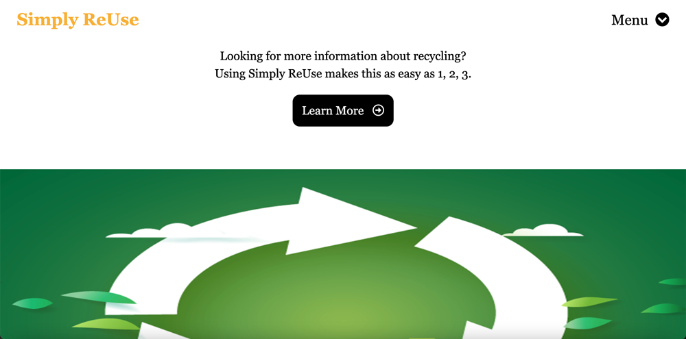
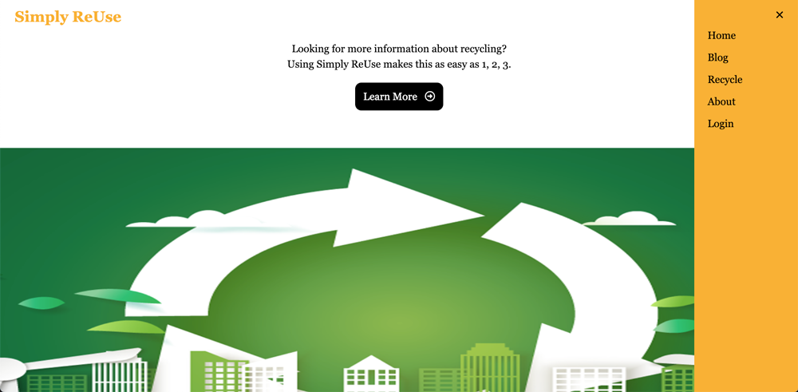
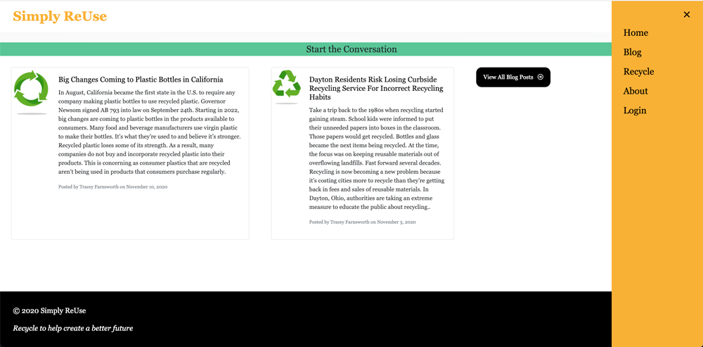
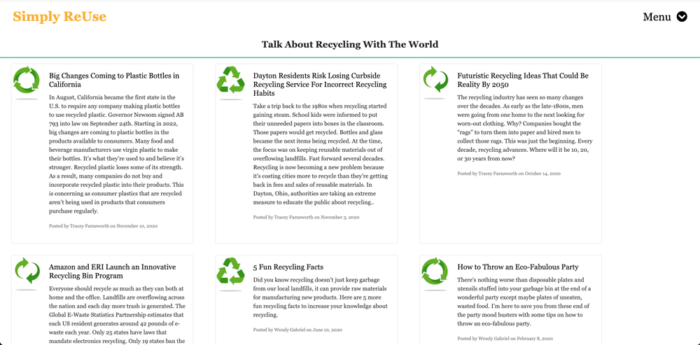
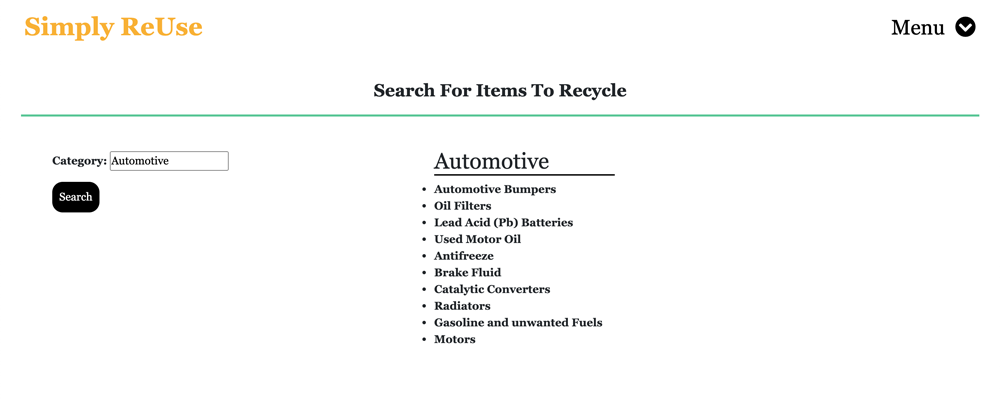

# Simply-ReUse

## Table of Contents
* [Description](#description)
* [Screenshots](#screenshots)
* [Installation](#installation)
* [Credits](#credits)
* [License](#license)
* [Contributors](#contributors)
* [Tests](#tests) 
* [Questions](#questions) 

### Description 
Simply ReUse is an app that targets users who want to learn more about recycling
Key features include: 
* View blog posts about Recycling
* Create a user login to share ideas, post, edit and delete their own comments
* View current environment news articles
* Search recycling categories for items that are recyclable 
<<<<<<< HEAD
=======

### Screenshots
##### Homepage

##### Homepage with NAV sidebar open

##### Homepage Blog Posts

##### Blog Page

##### Recycle Page

>>>>>>> 0871b1c78ae89534698ab10fa741a05c4eb24a17

### Installation
Start by doing an "npm i" in your terminal followed by creating a .env file with the database name, username and password

### Credits
Team: Brian Spiewak, Lucianne Vazquez, Peyton Schlafley 
References/Resources: 
Module 13: Object Relational Mapping (ORM)
Module 14 Model-View-Controller (MVC)  
* NPM connect session sequelize, https://www.npmjs.com/package/connect-session-sequelize  
* Sequelize Model Basics, https://sequelize.org/master/manual/model-basics.html  
* Sequelize basics, https://sequelize.org/v5/manual/querying.html#basics  
* Sequelize getting started, https://sequelize.org/v5/manual/getting-started.html   
* Sequelize doc's, https://www.npmjs.com/package/sequelize  
* NPM Express, https://www.npmjs.com/package/express-session   
* NPM bcrypt, https://www.npmjs.com/package/bcrypt   
* dotenv, https://www.npmjs.com/package/dotenv   
* SQL DEFAULT Constraint, W3Schools, https://www.w3schools.com/sql/sql_default.asp   
* npm inquirer package, https://www.npmjs.com/package/inquirer   
* mySQL2, https://www.npmjs.com/package/mysql2   
* NPM express-handlebars, https://www.npmjs.com/package/express-handlebars   
* Node.js mySQL Where, https://www.w3schools.com/nodejs/nodejs_mysql_where.asp   
* timeout, https://stackoverflow.com/questions/57120577/how-to-set-query-timeout-in-sequelize & https://stackoverflow.com/questions/50094169/redirect-to-login-page-after-session-timeout-using-nodejs-expressjs-and-reactjs
* NPM Fuzzy search, https://www.npmjs.com/package/fuzzy-search   
* CSS, https://stackoverflow.com/questions/6786511/how-to-fix-a-div-to-top-of-page-with-css-only

### License
  
This app is licensed under the Mozilla Public License 2.0.

### Contributors
Brian Spiewak, Lucianne Vazquez, Peyton Schlafley 

### Tests 
Tested applications adding console logs and using Insomnia Core to test the environments. 
Used jest to test the code, created a test and a helpers test file to test date formatting, plurals and URLs. 

### Questions 
* For questions, contact any team member using the following email addresses:   lucianne21@comcast.net, bspiewak6@gmail.com or pschlafley0@gmail.com
* GitHub Usernames: bspiewak6, Lucianne302 and PSchlafley
<<<<<<< HEAD
* Heroku Deployed App Link: https://simplyreuse.herokuapp.com/
=======
* Heroku Deployed App Link: https://simplyreuse3.herokuapp.com/
>>>>>>> 0871b1c78ae89534698ab10fa741a05c4eb24a17
* Repository Link: https://github.com/pschlafley/Simply-ReUse
